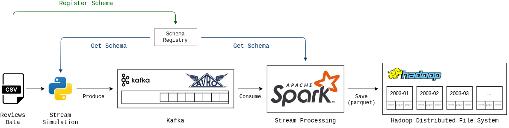
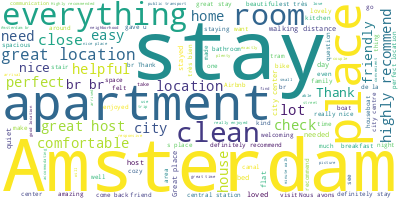

# Airbnb Review Pipeline

A local streaming data pipeline that publishes Airbnb review data to Apache Kafka, validates and serializes records with Avro and Schema Registry, processes the stream with Apache Spark, and stores partitioned Parquet data in Hadoop HDFS.

Repository: [karanpraja902/airbnb-review-pipeline](https://github.com/karanpraja902/airbnb-review-pipeline)

Author and maintainer: [karanpraja902](https://github.com/karanpraja902)

## Architecture



The pipeline follows this flow:

1. A Python producer reads Airbnb reviews from CSV.
2. Schema Registry supplies the Avro schema used to serialize each review.
3. Kafka receives serialized records on the `airbnb-reviews` topic.
4. Spark Structured Streaming deserializes and processes the records.
5. Spark writes Parquet files to `/airbnb_review_pipeline/reviews` in HDFS, partitioned by review month.
6. A Spark job reads the stored comments and generates a word cloud.

## Technology

- Python 3.10+
- Apache Kafka and Confluent Schema Registry
- Apache Avro
- Apache Spark Structured Streaming
- Hadoop HDFS
- Polars
- Docker Compose V2

## Project structure

```text
.
├── assets/                 # Architecture and output images
├── docker/                 # Kafka, Confluent, Hadoop, and Spark services
├── playground/             # Exploration notebooks and conversion utilities
├── src/
│   ├── producer.py         # CSV-to-Kafka producer
│   └── spark/
│       ├── etl.py          # Kafka-to-HDFS streaming ETL
│       └── wordcloud.py    # HDFS review word-cloud job
├── requirements.txt
└── reviews.avsc            # Avro review schema
```

## Setup

Clone the repository and install the Python dependencies:

```bash
git clone https://github.com/karanpraja902/airbnb-review-pipeline.git
cd airbnb-review-pipeline
python -m venv .venv
source .venv/bin/activate
python -m pip install -r requirements.txt
```

On Windows PowerShell, activate the environment with:

```powershell
.\.venv\Scripts\Activate.ps1
```

### Download the dataset

Download an Amsterdam reviews dataset from [Inside Airbnb](https://insideairbnb.com/get-the-data/) and save it as:

```text
data/reviews/reviews.csv
```

The project was developed against the Amsterdam review schema represented in [`reviews.avsc`](reviews.avsc). Confirm that the downloaded CSV contains these columns before running the producer:

```text
listing_id, id, date, reviewer_id, reviewer_name, comments
```

### Prepare Spark images

The Compose stack expects locally available Spark master and worker images. The defaults are:

```text
spark-master:3.3.2-hadoop3
spark-worker:3.3.2-hadoop3
```

Build compatible Spark 3.3.2/Hadoop 3 images, or override the image names before starting the stack:

```bash
export SPARK_MASTER_IMAGE=your-spark-master-image:tag
export SPARK_WORKER_IMAGE=your-spark-worker-image:tag
```

PowerShell equivalent:

```powershell
$env:SPARK_MASTER_IMAGE = "your-spark-master-image:tag"
$env:SPARK_WORKER_IMAGE = "your-spark-worker-image:tag"
```

## Run the pipeline

Start the infrastructure:

```bash
docker compose -f docker/docker-compose.yml up -d
```

Register [`reviews.avsc`](reviews.avsc) in Schema Registry under the `airbnb-reviews-value` subject, then run the producer:

```bash
python src/producer.py
```

Copy and submit the Spark ETL job:

```bash
docker compose -f docker/docker-compose.yml cp src/spark/etl.py spark-master:/opt/etl.py
docker compose -f docker/docker-compose.yml exec spark-master spark-submit \
  --master spark://spark-master:7077 \
  --packages org.apache.spark:spark-avro_2.12:3.3.2,org.apache.spark:spark-sql-kafka-0-10_2.12:3.3.2 \
  /opt/etl.py
```

## Generate the word cloud

Copy and submit the word-cloud job after HDFS contains review data:

```bash
docker compose -f docker/docker-compose.yml cp src/spark/wordcloud.py spark-master:/opt/wordcloud.py
docker compose -f docker/docker-compose.yml exec spark-master spark-submit \
  --master spark://spark-master:7077 \
  /opt/wordcloud.py
```

Example output:



## Service ports

| Service | Port |
| --- | ---: |
| Kafka broker | 9092 |
| Schema Registry | 8099 |
| Hadoop NameNode | 9870 |
| Hadoop DataNode | 9864 |
| Spark master UI | 8080 |
| Spark worker UI | 8081 |
| Spark master | 7077 |

## Notes

- This repository is a local development and learning pipeline, not a production deployment.
- The producer expects the Avro subject to exist before it starts.
- The Docker stack uses single-node replication settings and fixed development credentials/configuration.
- Dataset content and licensing are governed by [Inside Airbnb](https://insideairbnb.com/get-the-data/).
